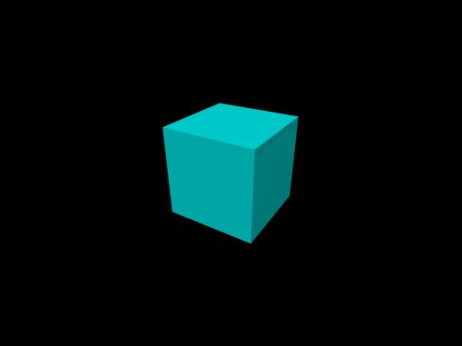

# Rend3 Examples

The examples are separate crates, so to run an example run `cargo run --bin <name>`.

| Name         | Description | Image |
|:------------:|:------------|-------|
| cube         | Basic example, best way to get started with the api. |  |
| gltf         | Similar to cube, but geometry is pulled from a gltf file |  |
| scene-viewer | Advanced example used to test rend3. |  |
