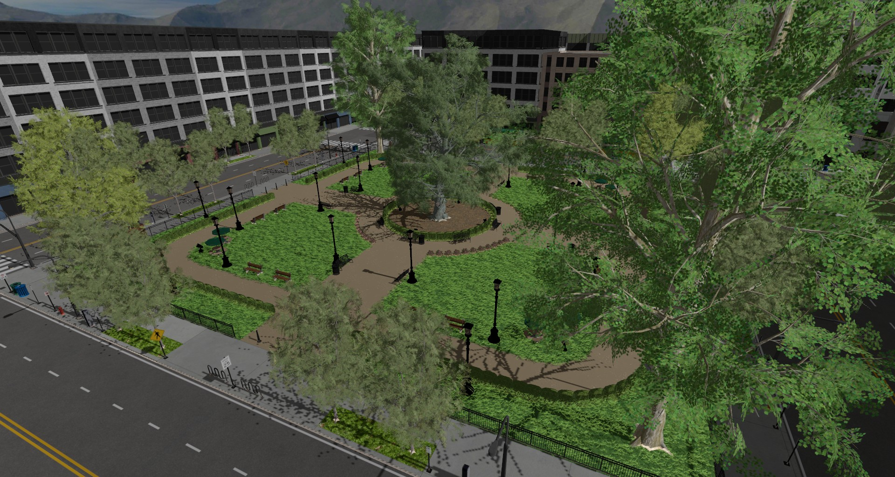

# rend3 Examples

The examples are separate crates, so to run an example run `cargo run --bin <name>`.

If you want to demo running rend3, [`scene-viewer`](scene-viewer) is what you should use. It is a full fledged gltf viewer.

If you want to look at how the basics of the code works, look at either the [`cube`](cube) or [`cube-no-framework`](cube-no-framework) example.

| Name                | Description | Image |
|:-------------------:|:------------|-------|
| scene-viewer        | Advanced gltf model and scene viewer. Used to test all of rend3's complex features. |     |
| cube                | Basic example. Shows how to get started with the api, both with and without the use of rend3-framework. |  |
| egui                | Shows integration with egui and rend3-egui |  |
| imgui               | Shows integration with imgui and rend3-imgui |  |
| skinning            | Basic bone deformation of a loaded gltf model |  |
| static-gltf         | Similar to cube, but geometry is pulled from a simple gltf file |  |
| textured-quad       | Basic 2D rendering with an orthographic camera |  |
