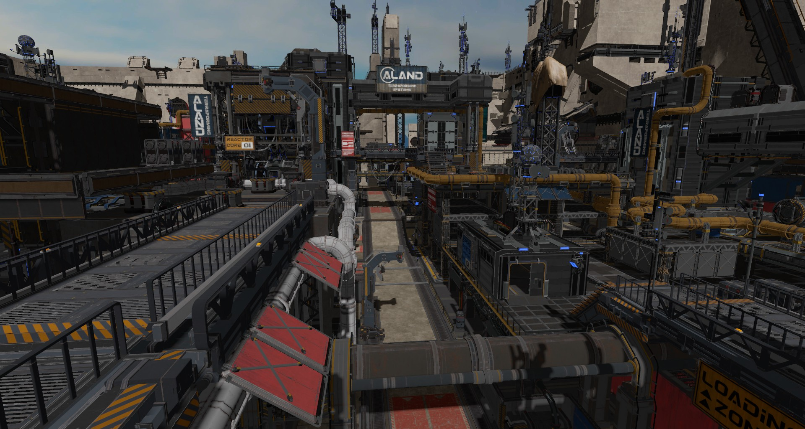

# rend3 Examples

The examples are separate crates, so to run an example run `cargo run --bin <name>`.

| Name                | Description | Image |
|:-------------------:|:------------|-------|
| cube (no-framework) | Basic example, best way to get started with the api. Second example cube-no-framework which shows how the parts put together without using the framework. |  |
| gltf                | Similar to cube, but geometry is pulled from a gltf file |  |
| scene-viewer        | Advanced example used to test rend3. |    |
| textured-quad       | Basic 2d rendering with an orthographic camera |  |
