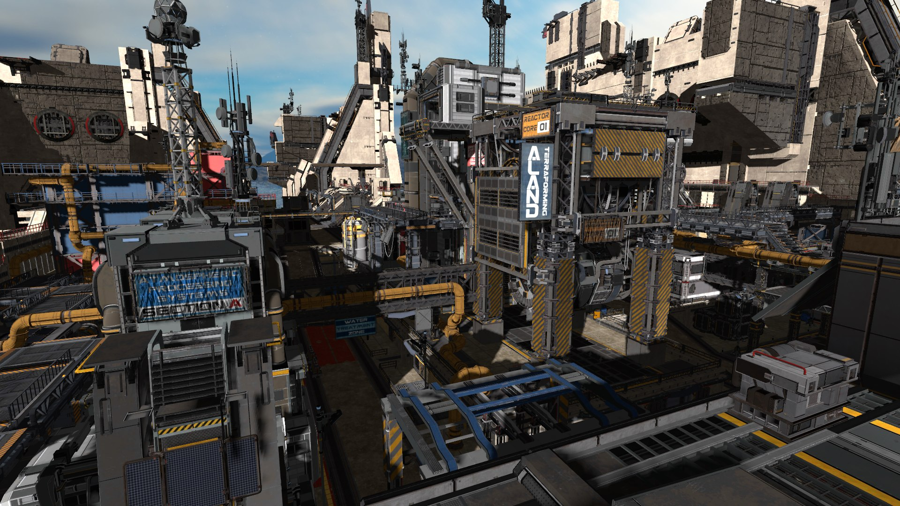

# scene-viewer

gltf (and glb) loader and viewer using the [rend3](https://crates.io/crates/rend3) rendering engine.

## Default Scene

To download the default scene:

```bash
# On windows, make sure to type curl.exe to get real curl, not the alias in powershell.
# On *nix, just type `curl`.
curl.exe https://cdn.cwfitz.com/scenes/rend3-default-scene.tar -o ./examples/scene-viewer/resources/rend3-default-scene.tar
tar xf ./examples/scene-viewer/resources/rend3-default-scene.tar -C ./examples/scene-viewer/resources
```

The source of the default scene is available here:

https://cdn.cwfitz.com/scenes/rend3-default-scene.blend

## Default Scene

Default scene, exposed through glTF:


```
cargo run --bin scene-viewer --release --  --shadow-distance 40 --msaa 4 --fullscreen
```

## Sci-fi Base

Exported Unity Scene through glTF:



```
cargo run --bin scene-viewer --release --  ..\gltf-export\sci-fi-base-ktx\sci-fi-base.gltf --shadow-distance 1000 --msaa 4 --gltf-disable-directional-lights --directional-light -1,-0.5,-1 --directional-light-intensity 20 --fullscreen
```

## Bistro

Bistro scene from [NVIDIA ORCA](https://developer.nvidia.com/orca) touched up by https://github.com/aclysma/rendering-demo-scenes


```
cargo run --bin scene-viewer --profile release --  ..\rendering-demo-scenes\bistro\bistro.gltf --normal-y-down --msaa 4 --gltf-disable-directional-lights --directional-light 1,-5,-1 --directional-light-intensity 15 --fullscreen
```

## Emerald Square

Emerald-Square from [NVIDIA ORCA](https://developer.nvidia.com/orca) exported to GLTF with blender:


```
cargo run --bin scene-viewer --release --  ..\gltf-export\emerald-square\untitled.gltf --shadow-distance 1000 --msaa 4 --gltf-disable-directional-lights --directional-light -1,-1,-1 
--directional-light-intensity 20 --fullscreen
```
